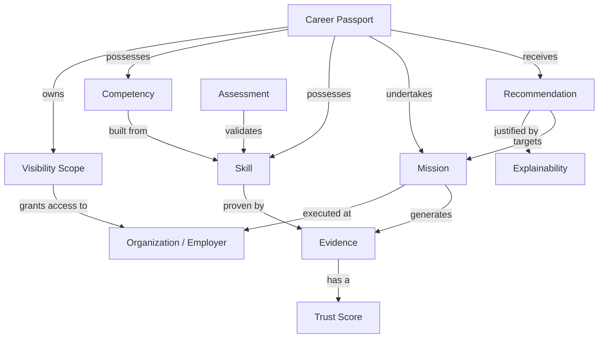

# Career Intelligence Framework (CIF-0001)

## 1. Vision
To establish an immutable, user-owned, evidence-driven model of professional capability that replaces static resumes with dynamic Career Passports. This model must be universally interpretable, fiercely objective, and inherently explainable.

## 2. Purpose
The Career Intelligence Framework (CIF) is the canonical business language of ProjectEcho. It defines the Ubiquitous Language used across the entire organization. Every API, database schema, and product feature must map strictly to the concepts defined in this document. 

## 3. Scope
The CIF defines business concepts, their logical properties, strict semantic boundaries, and the relationships between them. It is the sole authority on what business terms mean in ProjectEcho.

## 4. Out of Scope
The CIF does NOT define:
- Engineering architecture (e.g., Modular Monolith vs. Microservices).
- Backend implementation details or programming languages.
- Database schemas, table layouts, or query optimization.
- API REST/GraphQL payloads.
- Cloud infrastructure or deployment topologies.

## 5. Domain Principles
- **User Supremacy (FD-006):** The user owns their data.
- **Evidence Over Assertion:** A Skill without Evidence is treated as a claim, not a fact.
- **Explainable by Default:** Any recommendation or Readiness calculation must have a human-readable justification.
- **Durable Logic:** Business rules must outlive any specific technology stack.

---

## 6. Core Concepts

### Career Passport
- **Definition:** The root aggregate representing a user's verified, cumulative professional state over time.
- **Purpose:** To serve as the central, portable ledger of a user's career.
- **Owner:** Product Lead
- **Consumers:** Frontend, API, Rule Engine, AI
- **Related Concepts:** Skill, Evidence, Mission, Competency
- **Future Dependencies:** Database Schema (Root Entity), Core API Endpoints

### Skill
- **Definition:** A distinct, quantifiable ability possessed by a user.
- **Purpose:** The atomic unit of professional capability.
- **Owner:** Domain Architect
- **Consumers:** AI, Backend, Rule Engine
- **Related Concepts:** Competency, Evidence
- **Future Dependencies:** Recommendation Engine Algorithm, Assessment Logic

### Competency
- **Definition:** A proven grouping of skills applied successfully in a specific business context.
- **Purpose:** To bridge the gap between theoretical knowledge (Skill) and proven value delivery.
- **Owner:** Domain Architect
- **Consumers:** Rule Engine, AI
- **Related Concepts:** Skill, Mission, Readiness
- **Future Dependencies:** Matching Algorithms

### Evidence
- **Definition:** Immutable, verifiable proof backing a Skill or Competency claim.
- **Purpose:** To transform assertions into facts.
- **Owner:** Domain Architect
- **Consumers:** Rule Engine, Analytics
- **Related Concepts:** Trust Score, Evidence Lineage
- **Future Dependencies:** Data Pipeline, Blockchain/Ledger validation (if applied)

### Mission
- **Definition:** A time-bound, objective-driven business effort undertaken by a user that generates Evidence.
- **Purpose:** To provide context for how and where Skills were applied.
- **Owner:** Product Lead
- **Consumers:** Frontend, Backend, Analytics
- **Related Concepts:** Evidence, Employer, Role
- **Future Dependencies:** Workflow Service

### Recommendation
- **Definition:** A mathematically and logically justified proposed next step (e.g., a new Mission, a Learning Activity) for the user.
- **Purpose:** To drive career progression actively rather than passively.
- **Owner:** AI / Data Science Lead
- **Consumers:** Frontend, AI
- **Related Concepts:** Explainability, Mission
- **Future Dependencies:** Machine Learning Models, Prompt Engineering

---

## 7. Supporting Concepts

### Employer / Organization
- **Definition:** An entity where Missions are executed. Organizations issue verifiable Signals and Feedback but do not own Career Passports (FD-006).

### Role
- **Definition:** A formal title or scope of responsibility held by a user during a Mission.

### Assessment / Certification
- **Definition:** Formal, external verifications of a Skill provided by trusted third-party entities.

---

## 8. Derived Concepts

### Readiness
- **Definition:** A calculated, point-in-time percentage indicating a user's preparedness to successfully execute a specific Role or Mission.

### Explainability (Recommendation Reason)
- **Definition:** The deterministic, human-readable justification detailing exactly *why* a Recommendation was made, referencing specific Evidence.

### Trust Score
- **Definition:** A quantified confidence level attached to a piece of Evidence, based on its Lineage and Verification Authority.

---

## 9. Business Relationships

- A **Career Passport** *possesses* **Competencies** and **Skills**.
- A **Career Passport** *undertakes* **Missions**.
- A **Mission** *generates* **Evidence**.
- **Evidence** *proves* a **Skill** or **Competency**.
- **Evidence** *has a* **Trust Score**.
- A **Recommendation** *targets* a **Mission** and is *justified by* **Explainability**.

---

## 10. Lifecycle of a Career Passport
1. **Instantiation:** Created uniquely for a User.
2. **Accumulation:** Gathers Signals and Feedback over time.
3. **Verification:** Signals crystallize into Evidence.
4. **Maturation:** Evidence mathematically increases Trust Scores and Readiness.
5. **Portability:** Travels continuously with the user across different Employers (FD-006).

---

## 11. Explainability Principles
The system must never operate as a "black box." If the system dictates that a user's Readiness is 80%, the UI must be able to trace that 80% back to exact pieces of Evidence and their corresponding Trust Scores. AI is used to articulate this math to the user, not to invent the math.

## 12. Evidence Principles
Evidence decays over time (e.g., a technical skill from 1998 has less Trust Score today). Evidence is immutable; if proven false, it is superseded by a new negative verification event, but the original ledger entry remains.

## 13. Competency Principles
Competencies are contextual. A user may possess the "Python" Skill, but the "Data Engineering" Competency requires both the Skill and Evidence of it being applied in a Mission.

## 14. Mission Principles
Missions replace traditional "Jobs." A traditional 3-year employment stint is modeled as a series of distinct, sequential, or parallel Missions. 

## 15. Recommendation Principles
Recommendations must balance user goals with objective Readiness. A Recommendation is a synthesis of "What the user wants" and "What the Evidence supports."

## 16. Readiness Principles
Readiness is never 100%. It is a probabilistic score representing the gap between current Competencies and required Competencies for a target Mission.

## 17. Trust & Verification Principles
Not all Evidence is equal. A self-reported Skill has a base Trust Score. The same Skill verified by a formal Assessment has a high Trust Score. Verification increases Trust.

## 18. Access & Visibility Model (FD-006)
- **Ownership:** The User permanently and exclusively owns the Career Passport.
- **Tenancy:** Organizations represent access boundaries, not ownership silos. 
- **Visibility Scopes:** A User grants an Organization a "Visibility Scope" to view specific subsets of their Career Passport for a specified duration.
- **Revocation:** A User may revoke an Organization's access instantly.

---

## 19. Glossary

- **Signal:** Unstructured data that suggests a Skill exists but lacks formal verification (e.g., a peer's comment).
- **Feedback:** Qualitative input regarding a Mission's execution.
- **Career Path:** An optimized trajectory of recommended Missions.

---

## 20. Business Rules
1. **Rule of Evidence:** No Skill shall contribute to a Readiness score without linked Evidence.
2. **Rule of Portability:** No Organization may restrict a User's ability to export or migrate their Evidence.
3. **Rule of Traceability:** Every Recommendation must output an Explainability trace.

---

## 21. Mermaid Domain Diagram

---

## 22. Self Review

### Coverage Assessment
The CIF successfully defines all critical business semantics required for ProjectEcho without crossing into engineering territory. It provides a robust, ubiquitous language that aligns with Domain Driven Design (DDD) principles suitable for a 10-year lifespan.

### Founder Decisions Consumed
- **FD-006:** Fully incorporated. Section 18 establishes the Access & Visibility Model, enforcing that Users own the Passport and Organizations merely receive scoped access.

### Future Documents Depending on the CIF
- **ADR-003 (Proposed):** Domain Event Boundaries (depends on Mission/Evidence lifecycles).
- **EAF-0001:** Modular boundary definitions (e.g., Passport Module, Evidence Module).
- **PRD-001:** MVP User flows for granting Visibility Scopes to Organizations.
- **Database Schema:** Tables mapping directly to `career_passport`, `skill`, `competency`, `evidence`.

### Open Questions
- None. The framework is logically complete for Phase 1. Subsequent minor definitions can be added via the standard DGS-0001 amendment process.
