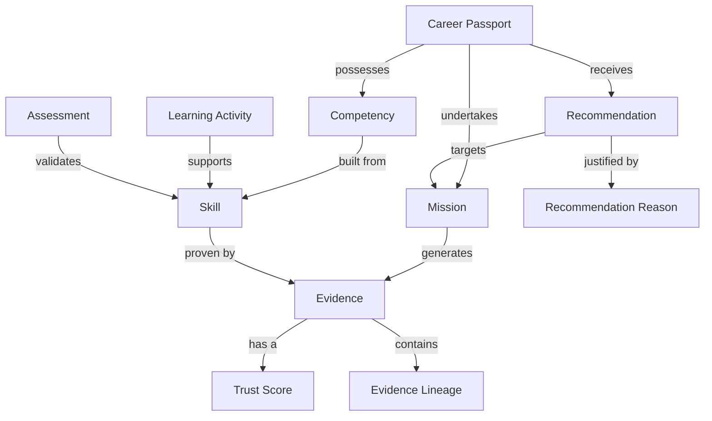

# Career Intelligence Framework Blueprint (CIF-BLUEPRINT-0001)

## Purpose
To design the structural and conceptual blueprint for the forthcoming Career Intelligence Framework (CIF). The CIF will become the canonical business language of ProjectEcho. 

## Scope
This document outlines WHAT business concepts will be defined in the CIF, their categorizations, their relationships, and how they map to downstream engineering. It does NOT define architecture, implementation, or engineering constraints.

---

## 1. Domain Boundary

`[FACT]` The CIF establishes the Ubiquitous Language (Domain Driven Design) for ProjectEcho. 

To maintain strict boundaries, concepts are segregated as follows:

- **Belongs in CIF:** Pure business entities, domain terminology, logical relationships, states, and business-driven constraints (e.g., *Skill*, *Evidence*, *Trust Score*).
- **Belongs in EAF (Architecture):** How domain events are passed, physical boundaries, distributed transaction handling, and component coupling.
- **Belongs in PRD (Product):** User journeys, UI layout requirements, feature release phasing, and success metrics.
- **Belongs in Rule Engine:** The mathematical weights for scoring, thresholds for promotion, and explicit hard-coded decision matrices.
- **Belongs in AI Prompts:** Narrative translation instructions, tonal constraints, and qualitative summary extraction logic.
- **Belongs in Backend Domain Model:** Java Entities, Repositories, Services, and persistence strategies implementing the CIF concepts.

`[RECOMMENDATION]` If a concept describes *how* something is stored, calculated, or displayed, it is strictly **Out of Scope** for the CIF.

---

## 2. Domain Vocabulary

`[RECOMMENDATION]` The CIF should categorize the raw business vocabulary into the following logical tiers to prioritize implementation.

### Core Concepts
The foundational entities of the business domain.
- **Career Passport:** The root aggregate representing a user's verified professional state.
- **Skill:** A distinct ability possessed by a user.
- **Competency:** A proven grouping of skills applied in context.
- **Evidence:** Immutable proof backing a Skill or Competency.
- **Evidence Lineage:** The traceable chain of custody for Evidence.
- **Mission:** A time-bound business objective generating Evidence.
- **Recommendation:** A proposed next step for the user.
- **Trust Score:** The quantified reliability of a piece of Evidence.

### Supporting Concepts
Entities that provide context to Core Concepts.
- **Employer:** The entity where a Mission occurred.
- **Role:** The title held during a Mission.
- **Project:** A sub-component of a Mission.
- **Learning Activity / Resource:** Educational inputs.
- **Assessment / Certification:** Formal external verifications.
- **Signal / Feedback:** Unstructured inputs that may mature into Evidence.
- **State / Progress / Constraint:** Status modifiers for Missions and Paths.

### Derived Concepts
Calculated or aggregated insights.
- **Readiness:** A calculated state indicating preparedness for a Role or Mission.
- **Career Path:** A sequence of roles/missions optimized for the user.
- **Recommendation Reason / Explainability:** The human-readable justification for a recommendation.
- **Confidence:** The systemic certainty of a calculation.

### Future Concepts (V2+)
- **Career DNA:** Highly abstracted behavioral profiling.
- **Competency Graph:** Macro-level organizational skill mapping.
- **Growth Plan:** Multi-year structured interventions.

### Out of Scope (Engineering/System Concepts)
- *Database Tables, API Endpoints, JWTs, WebSockets, Prompts, Rule Engine Nodes, Vector Embeddings.*

---

## 3. Concept Ownership

`[RECOMMENDATION]` Matrix of concept ownership and downstream propagation.

| Concept | Definition Owner | Primary Consumer | Dependent Documents | Appears In |
|---|---|---|---|---|
| **Career Passport** | Product Lead | Frontend, API | EAD, PRD | DB, AI, Frontend, Backend |
| **Evidence** | Domain Architect | Rule Engine | EAD, EDF | DB, Rule Engine, Backend |
| **Trust Score** | Data Science / Domain | Rule Engine | PRD, EAD | DB, Rule Engine, Analytics |
| **Mission** | Product Lead | Frontend, AI | PRD, EAD | DB, Frontend, Backend |
| **Recommendation** | AI/Data Science | AI, Frontend | PRD, EAD | Rule Engine, AI, Frontend |
| **Explainability** | Product Lead | User / Frontend | PRD, AI Prompts | AI, Frontend, Reports |

---

## 4. Relationship Map

`[RECOMMENDATION]` The core business semantic relationships. This is NOT an Entity-Relationship (ER) diagram for a database.

---

## 5. Future Dependencies

`[FACT]` The CIF serves as the dependency root for all subsequent technical and product documents.

| Future Document | CIF Dependency Usage |
|---|---|
| **ADR** | Uses CIF boundaries to define database segregation and domain events. |
| **RAR** | Audits codebase to ensure variables and packages match CIF naming. |
| **EAF** | Uses CIF aggregates to define Module boundaries (Modular Monolith). |
| **EAD / EDF** | Directly translates CIF concepts into Java Classes and APIs. |
| **PRD** | Uses CIF concepts to define user flows (e.g., "User accepts a Recommendation"). |
| **API** | JSON schemas map 1:1 with CIF entities. |
| **Backend** | Domain layer uses CIF terminology exclusively. |
| **Frontend** | UI components reflect CIF entities (e.g., `PassportCard`, `EvidenceTimeline`). |

---

## 6. Risks

`[INFERENCE]` The following risks must be mitigated during the drafting of the actual CIF.

- **Missing Concepts:** The boundary between "Project" and "Mission" is currently ambiguous.
- **Ambiguous Concepts:** "Signal" vs "Evidence" lacks a hard mathematical threshold in the business domain.
- **Overlapping Concepts:** "Competency" and "Skill" are often used interchangeably in industry; the CIF must define the strict difference.
- **Future Scaling Risks:** If "Evidence Lineage" implies cryptographic immutability, this heavily restricts the architecture. The CIF must clarify the *business* need for lineage.
- **Terminology Risks:** Developers shortening "Career Passport" to "User" or "Profile", breaking Domain Driven Design tracing.
- **AI Interpretation Risks:** AI models may hallucinate "Jobs" instead of "Missions" if the CIF does not provide explicit negative prompts/constraints.

---

## 7. Blueprint Conclusion

### 1. Coverage Score
`[INFERENCE]` 90%. The blueprint captures the vast majority of a modern Career Intelligence Platform's domain, but lacks explicit definition of the "Employer/Tenancy" semantic boundary.

### 2. Missing Concepts
- **Tenancy / Organization:** Does a Career Passport belong to the User or the Employer? 
- **Verification Authority:** Who asserts that an Assessment is valid?

### 3. Recommended CIF Structure
The final CIF document should follow this structure:
1. Executive Domain Summary
2. Core Entity Definitions (A-Z)
3. Domain Lifecycle States (e.g., Mission: Proposed -> Active -> Completed)
4. Domain Boundaries & Context Maps
5. Ubiquitous Language Glossary (Strict Do/Do-Not-Use list)

### 4. Estimated Number of CIF Sections
5 major sections, containing roughly 25-30 explicit concept definitions.

### 5. Recommended Review Strategy
1. **Drafting:** Chief Domain Architect drafts the CIF using this blueprint.
2. **Review:** Product leads review for business accuracy; Engineering leads review for implementability without dictating the implementation.
3. **Ratification:** Founder approves.

### 6. Founder Decisions Required
`[FOUNDER DECISION REQUIRED]` Before the CIF is drafted, the Founder must decide on the **Tenancy Model**:
- *Option A:* The Career Passport is strictly owned by the User (portable across employers).
- *Option B:* The Career Passport is owned by the Employer (isolated per B2B tenant).
*This dramatically alters the definition of "Evidence Lineage" and "Trust Score" in the CIF.*
