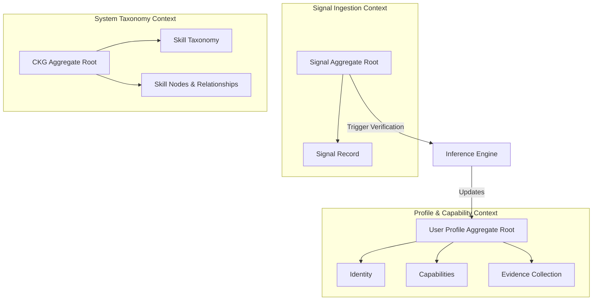
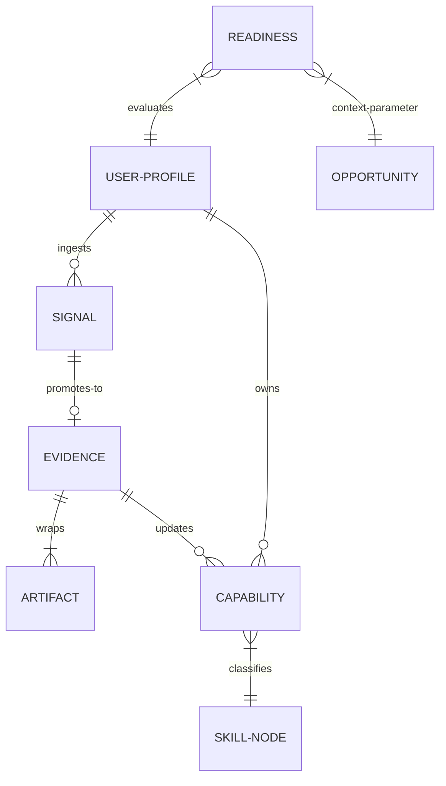

# Career Intelligence Framework (CIF) — ProjectEcho

**Document ID:** CIF-0001  
**Document Type:** Foundational Domain Framework  
**Status:** Active  
**Version:** 1.0  
**Classification:** Internal  
**Owner:** Chief Intelligence Officer  
**Date:** 2026-07-29  
**Review Cadence:** Semi-annually or on any foundational domain model change  
**Governed By:** GOV-FGM-0001  

---

## 1. Purpose, Scope & Authority

### 1.1 Purpose
The **Career Intelligence Framework (CIF)** is the canonical source of truth for ProjectEcho’s domain model, entities, and ubiquitous language. It defines the vocabulary and conceptual boundaries that all subsequent documents (PRD, EAD, API contracts, database schemas, AI prompts, and software modules) MUST use without deviation.

### 1.2 Scope & Authority
This framework applies to all technical and non-technical stakeholders of ProjectEcho. Under [GOV-FGM-0001](file:///Users/yash/Projects/ProjectEcho/docs/fgm/FGM.md#L65-L73), the CIF is a Rank 3 document, outranking all Architectural Decision Records (ADRs), Product Requirements Documents (PRDs), Engineering Architecture Documents (EADs), and source code. No subordinate document or codebase implementation may alter or contradict the concepts established herein.

---

## 2. Domain Philosophy

The Career Intelligence platform operates under six core domain principles:

1. **Evidence Over Claims:** A professional profile is a reflection of verified work, not self-reported assertions. Capabilities MUST be backed by verifiable Evidence.
2. **Competency Over Completion:** Simply completing or watching learning content does not represent skill growth. Progress is measured by demonstrated competency, not content consumption volume.
3. **Explainability:** Every assessment score, readiness state, and recommendation generated by the system MUST be traceable to its mathematical and data provenance.
4. **Deterministic Reasoning:** Crucial profile judgments (such as capability scoring and readiness) are governed exclusively by a deterministic Rule Engine. AI is restricted to personalized presentation and explanations.
5. **Traceability:** Any state in a user's Career Passport MUST trace back to its origin signal through an auditable processing pipeline.
6. **Human-in-the-Loop Validation:** While the system automates analysis, the user remains the ultimate authority for reviewing, disputing, and validating inferences.

---

## 3. Ubiquitous Language (Glossary)

To prevent ambiguity, the following glossary defines the canonical domain vocabulary. Forbidden alternative terms are strictly banned from all repository files.

### 3.1 Core Glossary Entries

#### Career Passport
* **Definition:** The external, secure, and portable representation of a User's verified capabilities, evidence, and professional readiness.
* **Purpose:** Acts as the user's secure, shareable profile for opportunities.
* **Synonyms:** Professional Passport, verified profile.
* **Forbidden Alternatives:** Resume, CV, bio, portfolio.
* **Relationships:** Composed of Capabilities, verified Evidence, and Readiness.

#### Capability
* **Definition:** A verified, scored dimension of skill, knowledge, or intent that a user has demonstrated.
* **Purpose:** Represents the granular units of what a user can actually do.
* **Synonyms:** Stored capability, capability score.
* **Forbidden Alternatives:** Skill level, badge, endorsement.
* **Relationships:** Belongs to a User Profile; updated exclusively via Evidence.

#### Competency
* **Definition:** The integration of multiple related Capabilities applied to execute a real-world task or mission successfully.
* **Purpose:** Measures higher-level practical application.
* **Synonyms:** Job competency, functional capability.
* **Forbidden Alternatives:** Certificate, course credit.
* **Relationships:** Rollup of multiple Capabilities.

#### Skill
* **Definition:** A specific technical or behavioral ability (e.g., "Java", "System Design") categorized within the taxonomy.
* **Purpose:** The taxonomic classification unit for Capabilities.
* **Synonyms:** Skill taxonomy node.
* **Forbidden Alternatives:** Tag, keyword, topic.
* **Relationships:** Lives in the Skill Taxonomy and Career Knowledge Graph.

#### Knowledge
* **Definition:** Theoretical understanding of a topic, distinct from the practical ability to apply it.
* **Purpose:** Tracks foundational and cognitive readiness.
* **Synonyms:** Theoretical comprehension.
* **Forbidden Alternatives:** IQ, smarts.
* **Relationships:** Maps to specific taxonomic topics.

#### Signal
* **Definition:** A raw, unprocessed unit of external input data capturing an activity, output, or transaction.
* **Purpose:** Ingestion boundary wrapper for all external data.
* **Synonyms:** Raw event, input event.
* **Forbidden Alternatives:** Notification, message, webhook payload.
* **Relationships:** Ingested via Signal Model; promoted to Evidence.

#### Evidence
* **Definition:** A Signal that has passed Verification Rules and has been promoted to a verified state.
* **Purpose:** The sole load-bearing source of truth for Capability changes.
* **Synonyms:** Verified signal, verified work.
* **Forbidden Alternatives:** Claim, reference, recommendation letter.
* **Relationships:** Created by promoting a Signal; updates Capabilities.

#### Artifact
* **Definition:** The concrete file, repository URL, or digital object (e.g., a GitHub commit, an assessment transcript) that supports a piece of Evidence.
* **Purpose:** Provides physical proof of work.
* **Synonyms:** Work artifact.
* **Forbidden Alternatives:** Document, attachment.
* **Relationships:** Contained within Evidence.

#### Mission
* **Definition:** A structured task or project designed to produce verifiable Evidence for specific Capabilities.
* **Purpose:** Directs users toward active skill validation.
* **Synonyms:** Challenge, project.
* **Forbidden Alternatives:** Assignment, homework, task list.
* **Relationships:** Recommended by the system to reduce Uncertainty.

#### Experience
* **Definition:** A historical record of time spent in a professional role, company, or environment.
* **Purpose:** Provides contextual background but does not directly modify Capabilities.
* **Synonyms:** Work history, employment.
* **Forbidden Alternatives:** Job, gig.
* **Relationships:** Forms part of the User Profile.

#### Confidence
* **Definition:** The system's measure of reliability regarding a specific Capability score, based on the age, volume, and quality of Evidence.
* **Purpose:** Quantifies scoring stability at the skill-node level.
* **Synonyms:** Reliability score, measurement confidence.
* **Forbidden Alternatives:** GPA, grade.
* **Relationships:** Maps to individual Capability nodes.

#### Readiness
* **Definition:** An on-demand contextual query determining suitability for a targeted opportunity or role.
* **Purpose:** Answers "Is this user ready for X, specifically?"
* **Synonyms:** Contextual readiness score.
* **Forbidden Alternatives:** Global score, rank, fit index.
* **Relationships:** Derived at query time from Capability, Confidence, and target Context.

#### Recommendation
* **Definition:** A system-generated action suggestion directed at either achieving a user's goal or reducing profile Uncertainty.
* **Purpose:** Directs user activity.
* **Synonyms:** Next step, suggestion.
* **Forbidden Alternatives:** Hint, tip.
* **Relationships:** Contains mandatory explainability contracts.

#### Assessment
* **Definition:** An evaluation mechanism (test, coding challenge, interview) that outputs a Signal.
* **Purpose:** Generates high-confidence Signals for verification.
* **Synonyms:** Test, exam.
* **Forbidden Alternatives:** Quiz.
* **Relationships:** Produces Signals.

#### Learning Objective
* **Definition:** A defined knowledge or capability threshold required to progress within a Growth Path.
* **Purpose:** Targets educational alignment.
* **Synonyms:** Study goal.
* **Forbidden Alternatives:** Syllabus topic.
* **Relationships:** Maps to Skills.

#### Growth Path
* **Definition:** A structured roadmap of Learning Objectives and Missions directed toward achieving a targeted Career Intent.
* **Purpose:** Guides users toward career goals.
* **Synonyms:** Learning path, roadmap.
* **Forbidden Alternatives:** Career ladder.
* **Relationships:** Composed of Missions and Learning Objectives.

#### User Profile
* **Definition:** The internal data model containing a user's Identity, Intent, Capabilities, and History.
* **Purpose:** The internal source of record for a user.
* **Synonyms:** Internal profile.
* **Forbidden Alternatives:** Account, DB record.
* **Relationships:** Assembled on-demand into Career DNA.

#### Organization
* **Definition:** An external entity (employer, educational institution, verifier) interacting with the platform.
* **Purpose:** Verifies or consumes Career Passports.
* **Synonyms:** Partner, school, company.
* **Forbidden Alternatives:** Client, tenant.
* **Relationships:** Hosts Opportunities.

#### Opportunity
* **Definition:** A defined professional role, project, or certification requirement profile hosted by an Organization.
* **Purpose:** Serves as the target context for Readiness queries.
* **Synonyms:** Job posting, requirement profile.
* **Forbidden Alternatives:** Opening, listing.
* **Relationships:** Parameterizes Readiness queries.

---

## 4. Core Domain Model (Conceptual Entities)

### 4.1 Signal
* **Responsibilities:** Wraps and normalizes raw external inputs (Git commits, resume parsers, assessment platforms).
* **Invariants:** Must contain a source timestamp, payload, unique origin identifier, and source metadata.
* **Lifecycle:** Ingested (Raw) -> Promoted (Verified) OR Rejected.

### 4.2 Evidence
* **Responsibilities:** Holds verified work records and references to concrete Artifacts.
* **Invariants:** Must have a reference to a verified Signal and at least one verifiable Artifact.
* **Lifecycle:** Active -> Decayed (Temporal decay over time).

### 4.3 Capability
* **Responsibilities:** Tracks current score, Confidence, and history for a specific taxonomic skill node.
* **Invariants:** Capability updates MUST be triggered only by the promotion of new Evidence.
* **Lifecycle:** Initialized -> Evolving -> Verified.

### 4.4 User Profile
* **Responsibilities:** Root identity wrapper containing historical records and capabilities.
* **Lifecycle:** Created -> Active -> Suspended.

---

## 5. Value Objects

1. **Artifact Reference:** Holds immutable metadata pointing to a Git hash, portfolio URL, or verification receipt. Immutable because past work is historical fact.
2. **Skill Node Coordinate:** Taxonomic ID representing a unique location in the Skill Taxonomy or CKG (e.g., `tech.backend.java`).
3. **Readiness Score:** A query result composed of a capability rollup, confidence weight, and uncertainty metrics. Derived and discarded; never persisted.

---

## 6. Aggregates & Bounded Contexts



* **User Profile Aggregate:** Manages Capabilities, Confidence collection, and personal metadata. Prevents concurrent modification of scoring history.
* **Career Knowledge Graph (CKG) Aggregate:** Manages taxonomic skill definitions and relation mappings. Updates to CKG do not directly modify user states.

---

## 7. Concept Relationship Diagram



---

## 8. Intelligence Model Data Flow

```
Raw Input (API/Upload)
       │
       ▼
 1. Universal Signal Model (Normalization) [Layer 1]
       │
       ▼
 2. Evidence Verification Rules (Verification Check) [Layer 1]
       │
       ▼
 3. Conflict Resolution Gate (Belief Determination) [Layer 1]
       │
       ▼
 4. Capability Model (Scoring & Confidence Calculation) [Layer 2]
       │
       ▼
 5. Contextual Readiness Engine (On-Demand Query Evaluation) [Layer 3]
       │
       ▼
 6. Career Passport (Secure Export / Presentation) [Layer 4]
```

---

## 9. Domain Rules (Invariants)

1. **No Evidence, No Capability:** A Capability score cannot exceed the initial baseline without a corresponding verified Evidence record.
2. **Zero Global Cache:** Readiness scores MUST NOT be stored in database tables. They MUST be calculated on demand to reflect live Capability decay and CKG taxonomic shifts.
3. **Traceability Guarantee:** Every capability score update MUST point to a collection of active Evidence records.

---

## 10. Terminology Governance

1. **Introduction of New Terms:** New domain concepts MUST be proposed via a Repository Architecture Report (RAR) and approved by the Chief Intelligence Officer.
2. **Deprecations:** Old terms MUST be marked with `[DEPRECATED]` in this document and mapped to their canonical replacements. Subordinate documents MUST update references within 1 review cadence.
3. **Validation Rule:** Automation scripts and AI prompt engines MUST block any PR containing terms listed as "Forbidden Alternatives" in Section 3.

---

## 11. Cross-Reference Map

* **PRD Alignment:** User profiles, goals, and opportunities defined in the future PRD MUST map directly to `User Profile`, `Intent`, and `Opportunity`.
* **EAD Alignment:** DB tables and entity classes representing skills, capabilities, and events MUST map to `Skill`, `Capability`, and `Signal` respectively.

---

*Framework document authorized by the Chief Intelligence Officer.*
