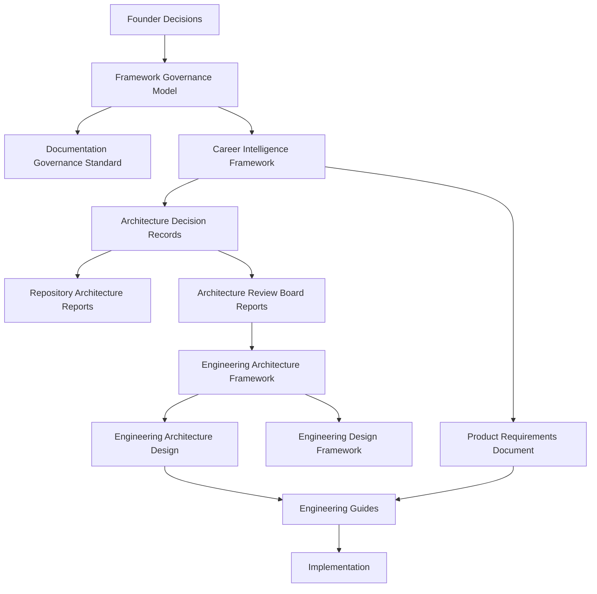
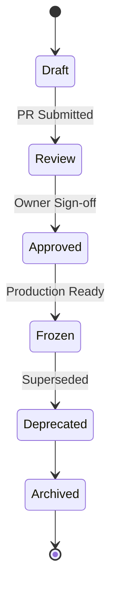
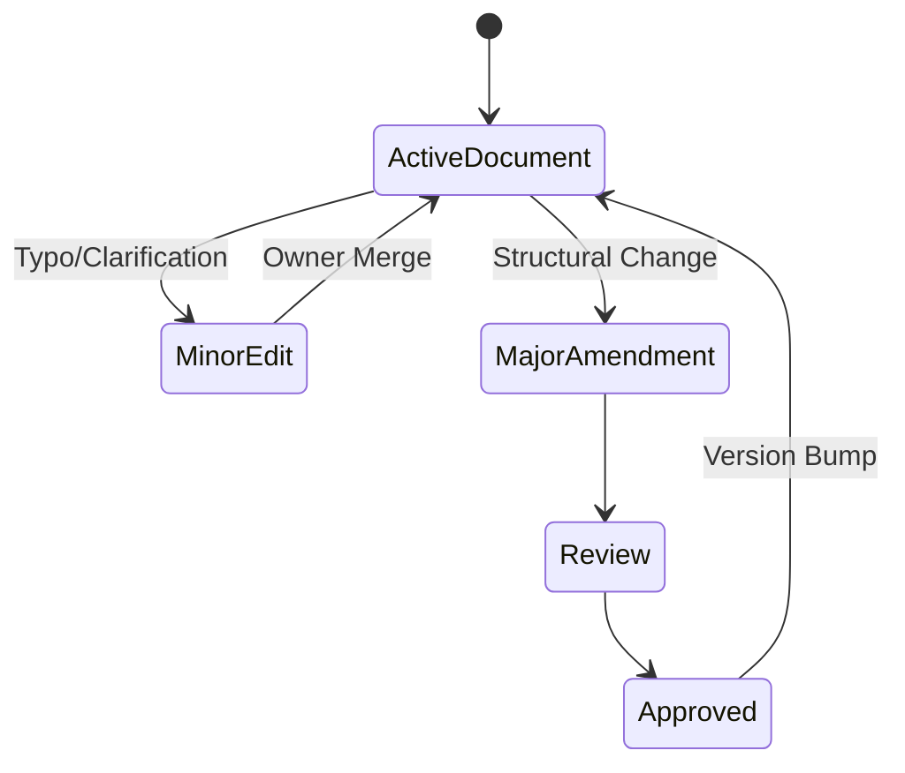
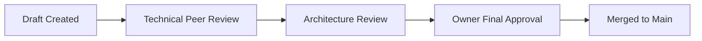

# Framework Governance Model (FGM-0001)

## 1. Governance Philosophy
Governance precedes implementation. The ProjectEcho repository operates under the belief that decisions made implicitly, untracked, or outside of version-controlled frameworks lead to technical debt, architectural drift, and organizational entropy. The FGM acts as the legal constitution of the repository, ensuring all decisions are explicit, traceable, and authoritative.

## 2. Governance Principles
- **Documentation is Authoritative:** The codebase reflects the governance; governance does not reflect the codebase.
- **Single Source of Truth:** A decision exists in one place. Other documents cross-reference it.
- **Traceability:** Every technical, architectural, and engineering decision must trace back to a Founder Decision or a ratified domain framework.
- **Immutability of Decisions:** Once ratified and frozen, foundational decisions cannot be altered, only superseded via a formal process.

## 3. Governance Objectives
- Eliminate ambiguity in decision-making and ownership.
- Prevent architectural regression.
- Standardize the lifecycle and authority of all project documents.
- Provide clear boundaries for autonomous AI assistants.

## 4. Governance Scope
This document governs:
- The hierarchy of authority within the repository.
- The creation, approval, and lifecycle of all governance, architecture, and engineering documents.
- The formal adoption of the Documentation Governance Standard (DGS-0001).

## 5. Out of Scope
This document does NOT govern:
- Software architecture (e.g., Monolith vs. Microservices).
- Business domain terminology (managed by the CIF).
- Coding styles or PR workflows (managed by Engineering Guides).

## 6. Authority Model
Authority is absolute and top-down. If a lower-level document contradicts a higher-level document, the higher-level document is correct by default, and the lower-level document must be amended or deprecated.

## 7. Governance Hierarchy

## 8. Document Classification
- **Founder Decisions:** Ultimate project mandates.
- **Governance (FGM, DGS):** Constitutional laws of the repository.
- **Frameworks (CIF, EAF, EDF):** Domain and architectural boundary constraints.
- **Decisions (ADR, ARBR):** Specific, isolated technical choices.
- **Specs (PRD, EAD):** Implementation plans.
- **Implementation:** Source code and tests.

## 9. Document Ownership
Every document must have a single Owner (Role or Individual). 
- **Founders** own Founder Decisions and FGM.
- **Governance Leads** own DGS.
- **Product/Domain Leads** own CIF and PRD.
- **Principal Architects** own ADR, ARBR, RAR, and EAF.
- **Engineering Leads** own EAD, EDF, and Engineering Guides.

## 10. Decision Types
- **Founder Decisions:** Strategic business or core vision changes.
- **Governance Decisions:** Changes to how the project operates (FGM/DGS).
- **Architecture Decisions:** Irreversible technical choices (ADR).
- **Engineering Decisions:** Reversible technical choices (EAD).
- **Product Decisions:** Feature scope (PRD).

## 11. Founder Decision Process
Founder Decisions are supreme. They may be issued ad-hoc via PR, issue, or dedicated file. A Founder Decision immediately overrides any conflicting document in the repository, triggering an automatic requirement to amend the affected lower-level documents.

## 12. ADR Process
Architecture Decision Records (ADRs) capture significant architectural choices.
1. **Drafting:** An architect proposes an ADR mapping a technical choice to a CIF domain.
2. **Review:** Peer review by engineering and architecture boards.
3. **Approval:** Ratification by the Principal Architect.
4. **Execution:** The architecture becomes binding for all future EADs and implementations.

## 13. Framework Lifecycle
Frameworks (FGM, CIF, EAF) govern broad, long-lasting rulesets. They follow a strict lifecycle of Draft, Review, Approved, and Frozen. Unlike ADRs, frameworks can receive minor amendments, but major structural changes require a new major version.

## 14. Document Lifecycle

## 15. Amendment Process

## 16. Versioning Rules
All governance documents use Semantic Versioning (Major.Minor).
- `0.x`: Drafts.
- `1.0`: Initially Approved.
- `1.x`: Minor amendments (typos, clarity) that do not change decisions.
- `2.0`: Major rewrite or structural overhaul.

## 17. Conflict Resolution Process
If a conflict between two documents is discovered:
1. Log the conflict in the Repository Conflict Register (RCR).
2. Determine precedence using the Governance Hierarchy (Section 7).
3. The lower-precedence document is marked for immediate remediation.
4. If the documents hold equal precedence, escalate to the Founder.

## 18. Review Workflow
Documents entering the `Review` phase must be evaluated against the DGS-0001 Review Checklist. No document may proceed to `Approved` if it violates DGS-0001 structural mandates.

## 19. Approval Workflow

## 20. Repository Governance
The repository state (branches, PRs, CI/CD) must physically enforce this governance model. Merge checks must require appropriate owner approvals for changes to restricted paths (e.g., `docs/fgm/`).

## 21. AI Governance
AI Assistants (Agents) are bound by the FGM.
- **Allowed:** Proposing Drafts, performing technical reviews, querying context, linting against DGS-0001.
- **Prohibited:** AI Assistants may NEVER autonomously approve an ADR, ratify a Framework, or issue a Founder Decision. All AI-generated governance must be approved by a human owner.

## 22. Change Management
Changes to the FGM itself require explicit Founder approval. Downstream frameworks require Architecture or Engineering Lead approval.

## 23. Compliance Rules
- Every pull request introducing code MUST link to an EAD or ADR.
- Every architectural component MUST map to a CIF domain.
- The `DGS-0001` format is legally binding for all documents.

## 24. Exception Handling
Exceptions to governance rules are permitted only via a formally approved ARBR (Architecture Review Board Report) that explicitly lists the duration, scope, and technical justification of the exception.

## 25. Governance Audits
The Governance Lead shall perform a full repository audit bi-annually, producing a RAR (Repository Architecture Report) to score compliance against the FGM.

## 26. Governance Metrics
- **Conflict Resolution Time:** Average time to close RCR items.
- **Traceability Coverage:** % of PRs linked to an approved Document.
- **Document Rot:** % of documents past their Next Review date.

## 27. Governance Anti-patterns
- **Implicit Architecture:** Building without an ADR.
- **Zombie Documents:** Approved documents that no one reads or enforces.
- **Circular Dependencies:** Documents cross-referencing each other for authority.

## 28. Governance Glossary
- **Ratification:** The formal act of approving a framework.
- **Supersede:** To replace an older, frozen document with a new one.

## 29. Governance Appendix
- **DGS-0001:** Formally adopted and incorporated by reference.
- **Conflict Register:** Governed under Section 17.
