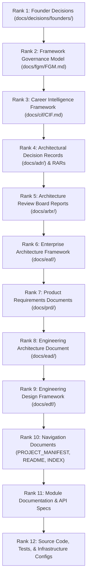
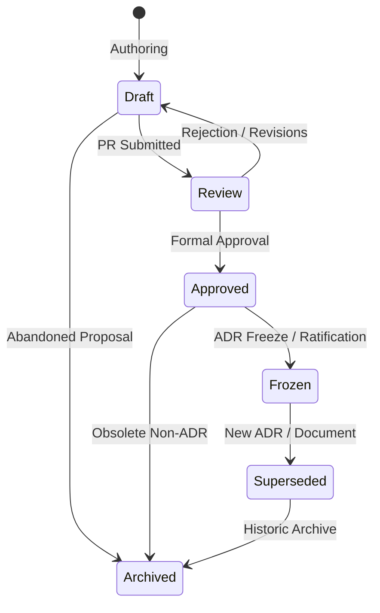
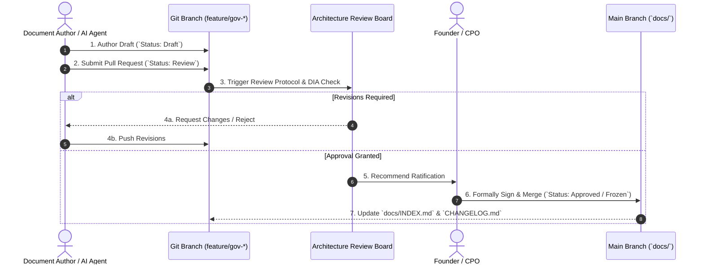

# Framework Governance Model (FGM) — ProjectEcho

**Document ID:** GOV-FGM-0001  
**Document Type:** Foundational Governance Framework  
**Status:** Active  
**Version:** 1.0  
**Classification:** Internal  
**Owner:** Founder & Technical Architecture Engineering  
**Date:** 2026-07-29  
**Review Cadence:** Semi-annually or on any Founder Decision affecting governance hierarchy  

---

## 1. Purpose & Scope

### 1.1 Purpose
The **Framework Governance Model (FGM)** is the supreme operational governance document for ProjectEcho. It establishes the legalistic framework by which all documentation, architectural decisions, product specifications, and engineering artifacts are proposed, evaluated, approved, frozen, amended, and retired.

### 1.2 Scope & Binding Authority
This model applies to all contributors, maintainers, automated AI agent assistants (including Google Antigravity, Claude, and specialized subagents), and organizational roles interacting with the ProjectEcho repository.

* **Normative Force:** The keywords **MUST**, **MUST NOT**, **REQUIRED**, **SHALL**, **SHALL NOT**, **SHOULD**, **SHOULD NOT**, **RECOMMENDED**, **MAY**, and **OPTIONAL** in this document carry strict normative weight per RFC 2119.
* **Precedence Authority:** This document outranks all architectural frameworks, product requirements, navigation documents, engineering guides, and source code. It is subordinate only to explicit **Founder Decisions**.

---

## 2. Governance Principles

Every engineering and documentation activity in ProjectEcho MUST conform to six foundational principles:

1. **Governance Before Implementation:** Governance documents and architectural decisions MUST precede code. No feature, module, or database schema SHALL be implemented without an approved, governing document.
2. **Architecture Before Code:** Implementation logic SHALL be constrained by an approved Engineering Architecture Document (EAD) and architectural decisions (ADRs). Code MUST NOT invent architecture.
3. **Repository as Single Source of Truth:** The repository is the canonical source of truth for governance, architecture, and design. Uncommitted discussions, verbal agreements, or external chat logs carry zero architectural authority.
4. **Deterministic Traceability:** Every line of production code MUST be traceable back to an approved EAD, which MUST trace to an ADR/PRD, which MUST trace to the Career Intelligence Framework (CIF).
5. **Evidence-Based Engineering:** Technical decisions MUST be justified by empirical evidence, formal ADR trade-off analysis, or prototype benchmarks documented in Repository Architecture Reports (RARs).
6. **Archive Over Deletion:** Historical governance records, superseded ADRs, and obsolete architectural proposals SHALL be archived rather than deleted, preserving an auditable history of repository evolution.

---

## 3. Document Hierarchy & Precedence

To resolve precedence ambiguities ([CR-014](docs/reports/engineering/CONFLICT_REGISTER.md#cr-014)), all repository artifacts are organized into a strict **12-tier Precedence Hierarchy**. 

In the event of any conflict between two documents, the document carrying the higher rank **MUST** prevail. A document at a lower rank **SHALL NOT** introduce decisions, constraints, or terminology that contradict a higher-ranked document.



### 3.1 Detailed Precedence Ranking

| Rank | Artifact Category | Location / Scope | Description & Governance Rules |
|---|---|---|---|
| **1** | **Founder Decisions** | `docs/decisions/founders/` | Absolute authority. Written decisions issued directly by company Founders. |
| **2** | **Framework Governance Model (FGM)** | `docs/fgm/FGM.md` | Supreme repository governance framework (this document). |
| **3** | **Career Intelligence Framework (CIF)** | `docs/cif/CIF.md` | Canonical single source of truth for all domain entities, dimensions, and ubiquitous language. |
| **4** | **Architectural Decision Records (ADRs) & RARs** | `docs/adr/`, `docs/rar/` | Binding technical & architectural decisions. Frozen upon approval. |
| **5** | **Architecture Review Board Reports (ARBRs)** | `docs/arbr/` | Official review evaluations, audits, and formal recommendations by the ARB. |
| **6** | **Enterprise Architecture Framework (EAF)** | `docs/eaf/` | Structural primitive definitions (Modules, Engines, Repositories, Domain Events). |
| **7** | **Product Requirements Documents (PRDs)** | `docs/prd/` | Product feature specifications, user journeys, MVP scope, and acceptance criteria. |
| **8** | **Engineering Architecture Document (EAD)** | `docs/ead/` | Technical blueprint specifying packages, database schemas, APIs, and module interfaces. |
| **9** | **Engineering Design Framework (EDF)** | `docs/edf/` | UI design tokens, component contracts, and frontend/backend DTO specifications. |
| **10** | **Navigation Documents** | `PROJECT_MANIFEST.md`, `README.md`, `PROJECT_STATUS.md`, `docs/INDEX.md` | Maps and status dashboards. **MUST NOT** introduce ungoverned decisions or override ADRs. |
| **11** | **Module Documentation** | `backend/*/README.md`, OpenAPI specs | Component-level developer guides and API schemas. |
| **12** | **Source Code & Infrastructure** | `backend/`, `frontend/`, `infrastructure/`, `docker-compose.yml` | Executable software implementation. **MUST** conform to Tiers 1–11. |

---

## 4. Document Lifecycle & Lifecycle Transitions

Every document in the repository MUST carry a valid `Status` metadata field matching one of six canonical lifecycle stages.



### 4.1 Lifecycle Stage Definitions

1. **Draft:** Initial authoring phase. Content is unapproved and SUBJECT TO CHANGE. MUST NOT be relied upon for production implementation.
2. **Review:** Under formal review by designated authorities (Founders, ARB, or Lead Architect). Content is locked for evaluation.
3. **Approved:** Formally ratified by the designated authority. Binding upon engineering work.
4. **Frozen:** Applied specifically to approved **ADRs** and **Framework Documents**. Contents are permanently locked against direct editing. Any modification REQUIRES a new document that supersedes it.
5. **Superseded:** Replaced by a newer approved document. Contains an explicit header link pointing to the superseding document. Preserved for historical audit.
6. **Archived:** Historical, obsolete, or abandoned document moved to `docs/archive/`. Retained for reference; carries zero governing authority.

---

## 5. Decision Authority Matrix (RACI)

The **Decision Authority Matrix** maps key repository decisions to designated roles using the RACI framework:
* **Responsible (R):** The role that authors and executes the deliverable.
* **Accountable (A):** The sole role with final approval authority and sign-off veto.
* **Consulted (C):** Subject matter experts whose input MUST be solicited prior to decision.
* **Informed (I):** Roles notified upon publication or status change.

| Decision Category | Founder | ARB | Principal Architect | CPO | Engineering Lead | Contributors / AI |
|---|---|---|---|---|---|---|
| **Product Vision & Scope (CR-001)** | **A / R** | C | C | R | I | I |
| **FGM Amendments** | **A** | C | R | I | I | I |
| **CIF Domain Modeling** | **A** | C | C | C | I | I |
| **ADR Approval & Freeze** | **A** | **A / R** | R | C | C | I |
| **EAF & EAD Ratification** | C | **A** | **R** | I | C | I |
| **PRD Approval** | **A** | C | C | **A / R** | C | I |
| **Tech Stack Selection** | **A** | C | R | I | C | I |
| **Module Reshape & Refactoring** | I | C | **A** | I | **R** | I |
| **PR / Code Review Approval** | I | I | C | I | **A** | **R** |

---

## 6. Change Management & ADR Amendment Policy

### 6.1 ADR Freeze & Supersession Policy
* **Immunity to In-Place Edits:** Once an ADR is marked `Approved — Frozen`, its decision text **MUST NOT** be modified, appended, or deleted under any circumstances, except for non-substantive errata (typos, broken file links).
* **Supersession Requirement:** To alter a decision in a Frozen ADR, an author MUST issue a **new ADR** (e.g., `ADR-0003`) that:
  1. Contains explicit header metadata: `Supersedes: ADR-0002 (Decision 001)`.
  2. Executes a formal **Decision Impact Assessment** per Section 6.2.
  3. Receives formal ARB and Founder approval.

### 6.2 Decision Impact Assessment (DIA)
Every new ADR or governance amendment MUST include a Decision Impact Assessment evaluating impact on:
* Affected Frameworks (FGM, CIF, EAF, EAD).
* Affected Modules & Interfaces.
* Deployment Topology & Operational Complexity.
* Migration Cost & Backward Compatibility.

### 6.3 Conflict Resolution Procedure
When two documents conflict, or a document conflicts with source code:
1. The conflict MUST be registered immediately in `docs/reports/engineering/CONFLICT_REGISTER.md` with an `S1` to `S4` severity.
2. The higher-ranked document in the **Precedence Hierarchy (Section 3)** automatically governs until a formal decision is issued.
3. If the conflict involves two documents of equal rank, execution on the affected module MUST halt, and the conflict MUST be escalated to the ARB or Founder.

---

## 7. Traceability Requirements

Every technical asset in ProjectEcho MUST satisfy the **Traceability Chain**:

$$\text{Source Code (Method/Class)} \longrightarrow \text{EAD Package/Module} \longrightarrow \text{EAF Primitive} \longrightarrow \text{ADR / PRD} \longrightarrow \text{CIF Domain Entity} \longrightarrow \text{Founder Vision}$$

### 7.1 Cross-Referencing Rules
1. **GitHub Markdown File Links:** All document references MUST use explicit clickable relative file links with standard markdown syntax: `[ADR-001](docs/adr/ADR-001-career-intelligence-framework-foundations.md)`.
2. **No Backticks in Link Text:** Link text MUST NOT contain backticks (e.g., use `[ADR-001](...)` instead of `[`ADR-001`](...)`) to ensure correct renderer formatting.
3. **Line Range Precision:** Code and configuration citations SHOULD include precise line range anchors (e.g., `[backend/pom.xml:L22-L30](backend/pom.xml#L22-L30)`).

---

## 8. Repository Standards & Document Metadata

### 8.1 Mandatory Metadata Block
Every markdown document created in `docs/` MUST begin with the standard 10-field YAML-like metadata header:

```markdown
# [Document Title]

**Document ID:** [TYPE-NNNN]
**Document Type:** [Framework / ADR / Standard / Report / Navigation]
**Status:** [Draft / Review / Approved / Frozen / Superseded / Archived]
**Version:** [X.Y]
**Classification:** Internal
**Owner:** [Role Name]
**Date:** [YYYY-MM-DD]
**Review Cadence:** [Cadence]
**Governed By:** [Higher-Ranked Document ID]
```

### 8.2 Standard Identifier Prefixes

| Asset Type | Prefix | Format | Example |
|---|---|---|---|
| **Framework Governance Model** | `GOV-FGM` | `GOV-FGM-NNNN` | `GOV-FGM-0001` |
| **Career Intelligence Framework** | `CIF` | `CIF-NNNN` | `CIF-0001` |
| **Architectural Decision Record** | `ADR` | `ADR-NNNN` (4 digits) | `ADR-0003` |
| **Architecture Review Board Report** | `ARBR` | `ARBR-NNNN` | `ARBR-0001` |
| **Enterprise Architecture Framework** | `EAF` | `EAF-NNNN` | `EAF-0001` |
| **Product Requirements Document** | `PRD` | `PRD-NNNN` | `PRD-0001` |
| **Engineering Architecture Document** | `EAD` | `EAD-NNNN` | `EAD-0001` |
| **Navigation Document** | `NAV` | `NAV-NNNN` | `NAV-0001` |
| **Audit / Conflict Report** | `REG` / `DAR` | `REG-CONF-NNNN` | `REG-CONF-0001` |

---

## 9. Review & Approval Workflow



---

## 10. Compliance & Non-Compliance

### 10.1 Definition of Compliance
A pull request or code change is compliant **ONLY IF**:
1. It is backed by an approved EAD and ADR.
2. It introduces no unapproved dependencies or microservice imports.
3. All modified documentation contains valid metadata and passes automated linting.

### 10.2 Non-Compliance Actions
* **Immediate Rejection:** Any PR introducing code before EAD ratification SHALL be closed without merge.
* **Conflict Filing:** Any PR introducing unapproved stack elements (e.g., unapproved message brokers or third-party libraries) SHALL trigger an immediate `S2` entry in `CONFLICT_REGISTER.md`.

---

## 11. Amendment Procedure for the FGM

This document (FGM) represents the core governance framework of ProjectEcho. It MAY be amended ONLY under the following strict conditions:

1. **Proposal:** An FGM Amendment Proposal MUST be drafted as a formal RAR (`docs/rar/`).
2. **Review Period:** The proposal MUST undergo a mandatory **7-day review period** by the Principal Software Architect and ARB.
3. **Founder Ratification:** Amendments to the FGM REQUIRE explicit, written approval and cryptographic/git signature from a company **Founder**.
4. **Version Bump:** Upon approval, the FGM version MUST increment (e.g., v1.0 to v1.1 for minor procedural updates; v1.0 to v2.0 for structural precedence changes).

---

## 12. Documents Requiring Alignment Upon FGM Ratification

Upon Founder ratification of this FGM, the following repository documents MUST be updated to reference and align with `GOV-FGM-0001`:

1. [PROJECT_MANIFEST.md](PROJECT_MANIFEST.md): Update "Documentation Hierarchy" Section to match Section 3 of FGM (resolving [CR-014](docs/reports/engineering/CONFLICT_REGISTER.md#cr-014)).
2. [docs/reference/standards/DOCUMENTATION_STANDARD.md](docs/reference/standards/DOCUMENTATION_STANDARD.md): Update `Governed By` header from `FGM — Not yet available` to `GOV-FGM-0001`.
3. [docs/adr/ADR-0002-modular-monolith-foundational-architecture.md](docs/adr/ADR-0002-modular-monolith-foundational-architecture.md): Update `Governed By` header to `GOV-FGM-0001`.
4. [docs/reports/engineering/CONFLICT_REGISTER.md](docs/reports/engineering/CONFLICT_REGISTER.md): Update `Governed By` header to `GOV-FGM-0001` and mark [CR-002](docs/reports/engineering/CONFLICT_REGISTER.md#cr-002) as `Resolved`.

---

## 13. Revision Change Log Template

```markdown
## Change Log

| Version | Date | Author / Role | Description of Changes | Approved By |
|---|---|---|---|---|
| 1.0 | 2026-07-29 | Senior Staff Engineer | Initial ratifiable draft of Framework Governance Model. Resolves CR-002 & CR-014. | Founder |
```

---

*Document authored by Technical Architecture Engineering & Founder Office.*
