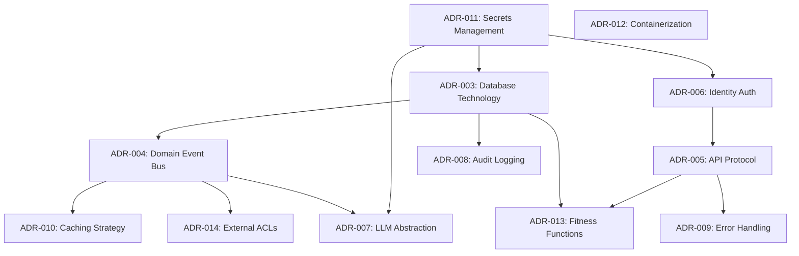

# Architecture Decision Backlog

**Governing Document:** EAD-001
**Owner:** Principal Software Architect

This backlog extracts all concrete architectural decisions implied by the Engineering Architecture Document (EAD) and identifies missing decisions required before engineering implementation can begin.

---

## 1. Extracted Architecture Decisions (Implied by EAD)

### ADR-003: Database Technology Selection
- **Status:** Proposed
- **Category:** Persistence
- **Decision Statement:** The persistence layer requires a specific technology selection (e.g., PostgreSQL) capable of supporting the strict data ownership and immutable audit requirements of the bounded contexts.
- **Why it deserves an ADR:** The database technology dictates transaction boundaries, consistency models, and operational scalability for the entire monolith.
- **Depends On:** EAD (Data Ownership)
- **Blocks:** Backend Implementation, Domain Repository Interfaces
- **Priority:** P0
- **Suggested Implementation Phase:** Foundation

### ADR-004: Domain Event Bus Implementation
- **Status:** Proposed
- **Category:** Integration
- **Decision Statement:** State mutations trigger asynchronous Domain Events routed through an in-memory event bus (or transactional outbox) for decoupled cross-module communication.
- **Why it deserves an ADR:** It defines how bounded contexts maintain eventual consistency without introducing brittle synchronous coupling or distributed transaction coordinators.
- **Depends On:** EAD (Communication Architecture)
- **Blocks:** Cross-module integrations, Intelligence calculations
- **Priority:** P0
- **Suggested Implementation Phase:** Core Platform

### ADR-005: API Protocol Selection
- **Status:** Proposed
- **Category:** API
- **Decision Statement:** The edge presentation layer (`echo-bootstrap`) exposes a unified API protocol (e.g., REST vs. GraphQL) to external consumers.
- **Why it deserves an ADR:** API choices permanently impact client integration, versioning strategies, and payload efficiency.
- **Depends On:** EAD (System Context)
- **Blocks:** Frontend Implementation, API Gateway
- **Priority:** P1
- **Suggested Implementation Phase:** Core Platform

### ADR-006: Identity Authentication Mechanism
- **Status:** Proposed
- **Category:** Security
- **Decision Statement:** The system utilizes stateless JWTs validated by `echo-identity` to establish the security context for all internal modules.
- **Why it deserves an ADR:** Authentication is the primary trust boundary; changing it later requires systemic rewrites across all endpoints.
- **Depends On:** EAD (Security Architecture)
- **Blocks:** All secured API endpoints, B2B integrations
- **Priority:** P0
- **Suggested Implementation Phase:** Foundation

### ADR-007: LLM Provider Abstraction Strategy
- **Status:** Proposed
- **Category:** AI
- **Decision Statement:** The AI Gateway within `echo-intelligence` must abstract the underlying Large Language Model provider to prevent vendor lock-in.
- **Why it deserves an ADR:** LLM APIs evolve rapidly; hardcoding provider-specific APIs creates brittle intelligence pipelines.
- **Depends On:** EAD (AI Gateway)
- **Blocks:** AI Feature Implementation, Recommendation Engine
- **Priority:** P1
- **Suggested Implementation Phase:** AI

### ADR-008: Immutable Audit Logging Strategy
- **Status:** Proposed
- **Category:** Observability / Security
- **Decision Statement:** All mutations to Evidence and Passport records emit an immutable audit log tied to the originating domain event.
- **Why it deserves an ADR:** Required for legal explainability, compliance, and debugging of Career Intelligence decisions.
- **Depends On:** EAD (Cross-Cutting Concerns)
- **Blocks:** Compliance Certification, Evidence Ingestion
- **Priority:** P1
- **Suggested Implementation Phase:** Core Platform

---

## 2. Missing Architecture Decisions (Not yet defined)

The following architectural topics are mandated by the EAF/EAD but lack a formal decision:

### ADR-009: Error Handling Strategy
- **Status:** Proposed
- **Category:** Architecture
- **Decision Statement:** Standardize the global exception hierarchy, error payload structure, and fault isolation mechanisms.

### ADR-010: Caching Strategy
- **Status:** Proposed
- **Category:** Performance
- **Decision Statement:** Define how ephemeral data (e.g., Readiness scores) is cached, invalidated, and segregated by tenant/Person.

### ADR-011: Secrets and Configuration Management
- **Status:** Proposed
- **Category:** Security
- **Decision Statement:** Establish how environment variables, database credentials, and API keys (e.g., OpenAI, OAuth) are securely injected into the runtime.

### ADR-012: Containerization and Deployment Topology
- **Status:** Proposed
- **Category:** Deployment
- **Decision Statement:** Define the exact runtime container standard (e.g., Docker, buildpacks) and orchestration environment (e.g., Kubernetes, ECS).

### ADR-013: Architectural Fitness Functions
- **Status:** Proposed
- **Category:** Governance / Testing
- **Decision Statement:** Select the automated tooling (e.g., ArchUnit) to actively enforce the Dependency Matrix and Module Catalog in CI/CD.

### ADR-014: External Anti-Corruption Layer (ACL) Implementation
- **Status:** Proposed
- **Category:** Integration
- **Decision Statement:** Define the structural pattern used to map external webhook payloads (e.g., GitHub, ATS) into the internal `Signal` DTOs.

---

## 3. ADR Dependency Graph

---

## 4. Recommended Approval Order

To unblock engineering implementation efficiently, the ADRs must be drafted, reviewed, and ratified in the following sequence:

### Phase 1: Foundation (Unblocks Infrastructure & Project Setup)
1. **ADR-011:** Secrets and Configuration Management (Prerequisite for DB and Identity)
2. **ADR-003:** Database Technology Selection
3. **ADR-006:** Identity Authentication Mechanism
4. **ADR-012:** Containerization and Deployment Topology

### Phase 2: Core Platform (Unblocks Backend Module Implementation)
5. **ADR-013:** Architectural Fitness Functions (Must exist before code is written to prevent degradation)
6. **ADR-004:** Domain Event Bus Implementation
7. **ADR-005:** API Protocol Selection
8. **ADR-009:** Error Handling Strategy

### Phase 3: Operations & Scale (Unblocks Production Readiness)
9. **ADR-008:** Immutable Audit Logging Strategy
10. **ADR-010:** Caching Strategy

### Phase 4: Integrations & AI (Unblocks Business Features)
11. **ADR-014:** External Anti-Corruption Layer (ACL) Implementation
12. **ADR-007:** LLM Provider Abstraction Strategy
