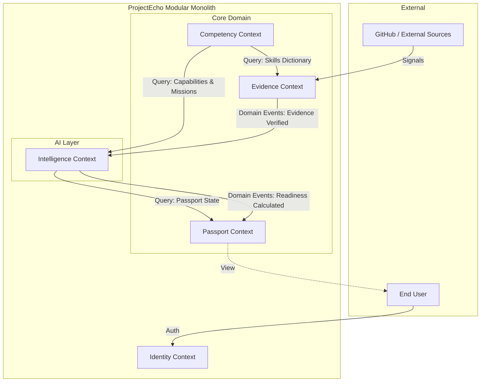

# Context Map

**Governing Document:** EAD-001

This map conceptually illustrates how the Bounded Contexts of ProjectEcho integrate, detailing the flow of data and the types of relationships (e.g., Upstream/Downstream, Customer/Supplier).

## Context Integration Flow

## Integration Patterns

1. **Evidence ➔ Intelligence (Upstream/Downstream via Events):** 
   - `echo-evidence` publishes a Domain Event (`EvidenceVerifiedEvent`).
   - `echo-intelligence` asynchronously consumes this event to recalculate Readiness without blocking the Evidence verification process.

2. **Intelligence ➔ Passport (Customer/Supplier via Events):**
   - When Readiness or Gaps change, `echo-intelligence` emits an event. 
   - `echo-passport` consumes this to update the materialized view of the Career Passport.

3. **Intelligence ➔ Competency (Synchronous Query):**
   - To calculate Gaps, `echo-intelligence` synchronously queries the `echo-competency` API for the structural definition of a Mission.

4. **External ➔ Evidence (Anti-Corruption Layer):**
   - External payloads (Signals) are mapped into internal domain structures strictly at the boundary of `echo-evidence` to prevent external models from polluting the domain.
