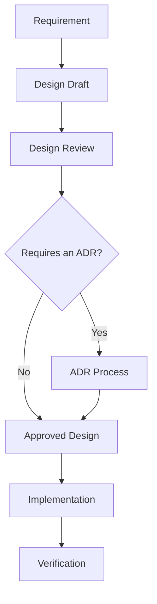

# ENGINEERING DESIGN FRAMEWORK (EDF)

**Document ID:** EDF-vMAJOR.MINOR
**Document Type:** Engineering Design Framework — how a feature is designed within the approved architecture
**Status:** Draft | In Review | Approved
**Version:** vMAJOR.MINOR
**Classification:** Internal
**Owner:** Principal Software Architect
**Date:** YYYY-MM-DD
**Review Cadence:** On material change to the EAD
**Governed By:** Engineering Architecture Document → Engineering Architecture Framework → ADRs → FGM
**Related Documents:**

---

## Purpose

The EDF defines the repeatable method by which an individual feature is designed, reviewed, and accepted inside the architecture the EAD establishes. The EAD says how the system is built; the EDF says how a *change* to it is designed.

## Authority

The EDF governs **design process and design artifacts**. It may not decide architecture, technology, or product scope.

## Scope

## Out of Scope

## Dependencies

Requires an approved EAD. An EDF authored ahead of the EAD would define a process for an architecture that does not yet exist.

## Related Documents

---

## 1. Design Lifecycle

The stages a feature design passes through, and the gate at each stage.

## 2. When a Design Requires an ADR

The explicit test. A design requires an ADR when it introduces a new Module boundary, changes a published interface, adds infrastructure, changes a trust boundary, or contradicts anything above it in the precedence chain.

Ambiguity here is expensive: state the test so that two engineers reach the same answer independently.

## 3. Required Design Artifacts

| Artifact | When required | Owner |
|---|---|---|

## 4. Design Document Structure

The sections every feature design contains: problem, affected Modules, domain model changes, interface changes, data changes, event changes, failure modes, security impact, observability, test strategy, rollout and flag plan.

## 5. Domain Modelling Method

How Aggregates, Entities, Value Objects, and invariants are identified — using EAF vocabulary only.

## 6. Interface Design Rules

Versioning, compatibility, deprecation. Reference the governing decision on whether every Module publishes a versioned interface.

## 7. Review Criteria

The checklist a reviewer applies. Reviews follow [`.ai/workflows/REVIEW_PROTOCOL.md`](../../.ai/workflows/REVIEW_PROTOCOL.md).

## 8. Definition of Done

## 9. Rejection Criteria

What causes a design to be sent back. Being explicit here is what keeps reviews from becoming negotiations.

## Self-Review

**Remaining Ambiguity:**
**Hidden Assumptions:**
**Founder Decisions Still Required:**
**Conflicts with existing governance:**
